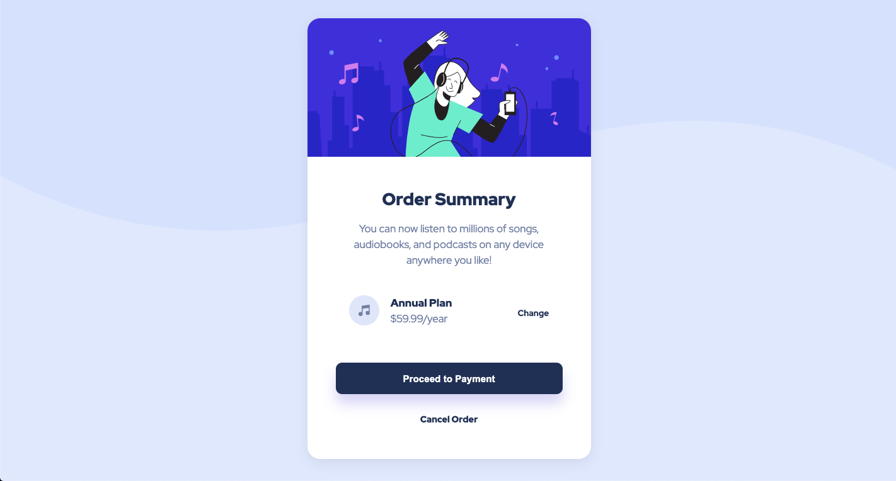

# Frontend Mentor - Order Summary Card Solution

This is a solution to the [Order summary card challenge on Frontend Mentor](https://www.frontendmentor.io/challenges/order-summary-component-QlPmajDUj). Frontend Mentor challenges help you improve your coding skills by building realistic projects. This is my first attempt at a challenge, and I have to say, it was a great experience.

## Table of contents

- [Overview](#overview)
  - [The challenge](#the-challenge)
  - [Screenshot](#screenshot)
  - [Links](#links)
- [My process](#my-process)
  - [Built with](#built-with)
  - [What I learned](#what-i-learned)
  - [Continued development](#continued-development)
  - [Useful resources](#useful-resources)
- [Author](#author)
- [Acknowledgments](#acknowledgments)

## Overview

### The challenge

Users should be able to:

- See hover states for interactive elements

### Screenshots

Default Link State


Hover Link State


### Links

- Solution URL: [Add solution URL here](https://www.frontendmentor.io/solutions/order-summary-site-using-html-and-custom-css-yiy85qpwR)
- Live Site URL: [Add live site URL here](https://bmoore15v.github.io/FM-Order-Summary-Challenge/)

## My process

### Built with

- Semantic HTML5 markup
- Custom CSS properties
- CSS Grid
- Mobile-first workflow

### What I learned

This was my first challenge on Frontend Mentor and I was pleasantly surprised on how comfortable I was jumping into the supplied code and tackling the problem. I had some difficulty in the beginning with setting the background image. It took me a long while of scouring the internet looking for a solution. I eventually realized that my issue was folder hierarchy.

This is what I originally typed, and I was sure it was correct:

```
body {
  background-image: url("images/pattern-background-desktop.svg");
}
```

I then looked into some of the source code to see if the authors linked their files differently somehow and I found this small difference

```
<link href="./images/favicon-32x32.png">
```

I added the `./` to my CSS and that still didn't work. It didn't quite click for me yet what I was doing wrong. I came across a few sites that gave advice on troubleshooting background-images not showing up and most of the comments highlighted the need to ensure your relative or absolute path is correct. It still wasn't clicking until finally someone in the comments gave this example in their relative path `../`. As soon as I saw that my CLI brain flipped on, and the lightbulb went off in my head and I realized my issue was folder hierarchy. So I added a second `.` to my CSS and voila, problem solved.

I felt like a noob for missing that. I was so focused on HTML and CSS that other aspects of Computer Science weren't in view. In all of my previous experiences with building a webpage, I typically was only pulling files from the same hierarchical level and that was not the case with the source code for this challenge. I needed to slow down and orient myself to the current problem at hand and not rely on previous successes as indicative of present success.

A few lessons learned:

- Even the small details matter
- If I am patient in locating the problem, I can find a solution.
- Don't let success in the past make me lazy in the present.
  I am happy to say that after that initial blunder, the rest of the build was pretty straight forward, just a matter of trial and error.

### Continued development

I would like to work on using `flexboxes` more in future builds. I positioned the main container and adjusted the margins accordingly to make the layout how I wanted, but I would like to find a different solution for the next build.

### Useful resources

- [MDN](https://developer.mozilla.org/en-US/) - I learned a lot more about the `background-image` property on this go around and as always, MDN came in clutch.
- [Codepen button shadow example](https://codepen.io/seme332/pen/reJOwo) - This was a very helpful visualization on how to manipulate a shadow on a button. It was helpful to play with the settings in this environment to get a grasp of what I wanted to do. I'd recommend building something in Codepen or finding someone's example to help visualize what you're doing in a focused way.

## Author

- Website - [To Work & Keep](https://www.toworkandkeep.com)
- LinkedIn - [Let's Connect](https://www.linkedin.com/in/bmoore15v/)
- Frontend Mentor - [@bmoore15v](https://www.frontendmentor.io/profile/bmoore15v)
- Twitter - [@bmoore15v](https://www.twitter.com/bmoore15v)

## Acknowledgments

Thanks to [Dr. Angela Yu](https://www.udemy.com/user/4b4368a3-b5c8-4529-aa65-2056ec31f37e/) and her [Web Development Bootcamp Course](https://www.udemy.com/course/the-complete-web-development-bootcamp/) on Udemy. I have made tremendous strides understanding the fundamentals of Web Development and in turn being able to complete this challenge as quickly as I did with her help.

